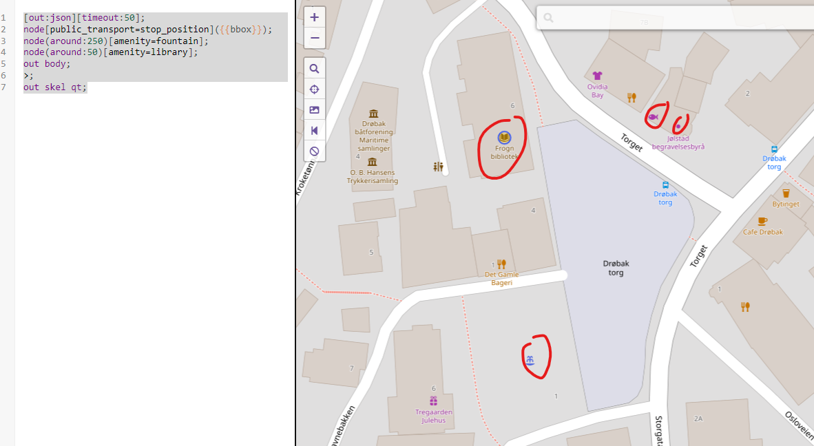

# DAY 5 - Turbo Osint

## Description
````
Gjennom temmelig hemmelige innhentingsmetoder har vi fanget opp en melding om et nært forestående møte på Fastlands-Norge mellom en mistenkt kildefører som jobber for sydpolare tjenester og et ukjent objekt vi mistenker kan være en muldvarp.

For at våre spaningsalver skal settes i stand til å observere møtet og identifisere det ukjente objektet må vi vite hvor vi skal sende våre alver.

Vi prøvde å spørre OSINT-alvene våre, men de var travelt opptatt med å saumfare sosiale medier etter snille og slemme barn. De mumlet noe om at vi kunne fikse det selv med “turbo overgang”.

Kan du ut fra meldingen finne ut hvor de skal møtes?

Ta bussen og gå av på holdeplassen rett ved begravelsesbyrået som ligger 
inntil en sjømatbutikk. Jeg vil stå klar ved fontenen noen titalls meter 
fra bussholdeplassen. Når du har kommet frem til fontenen, vil vi sammen 
gå til det nærliggende biblioteket som ligger under 50 meter fra fontenen 
og gjennomfører overføringen.

Svar meg med navnet på møtestedet og på formen PST{BERGEN LUFTHAVN}

- Tastefinger
````

## Solution
It gives ut a clue to use: https://overpass-turbo.eu/ we can use that page
along with https://wiki.openstreetmap.org/ to find the locations.

First we need to find the bus stop. We can use the query:


```
[out:json][timeout:50];
node[public_transport=stop_position]({{bbox}});
node(around:250)[amenity=fountain];
node(around:50)[amenity=library];
out body;
>;
out skel qt;

```

It will find all the bus stop, and fountains and then librays around the give
parameters. You get maybe 4-5 results. But the one that have all criteria is
Frogn bibliotek.




### Flag
```
PST{Frogn bibliotek}
```