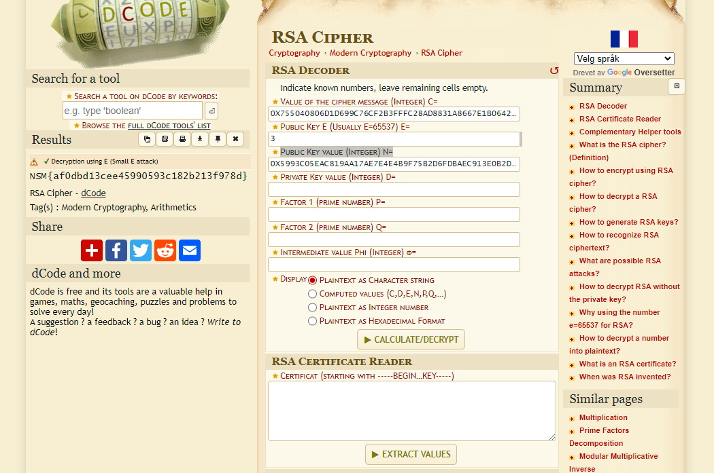

# DAY 7 - RSA Encryption

## Description
````
Alveresepsjonen fant en mystisk lapp i postboksen til Nissens verksted i dag tidlig. 
Vanligvis er dette noe Ronny, Shahana og Ada fra alvdeling for kryptografi ville tatt seg av. 
Dessverre er alle tre bortreist på en viktig konferanse i San Francisco for å høre om den siste 
utviklingen innen eksponenter og modulær aritmetikk. Kan du steppe inn for dem og finne ut av 
hva denne beskjeden egentlig er for noe?

- Mellomleder

📎msg.txt
````

## Solution
Ronny, Shahana og Ada spells RSA. This is a hint for the encryption used. So we need to use RSA to solve this.

I used: https://www.dcode.fr/rsa-cipher to decode the message.



### Flag
```
NSM{af0dbd13cee45990593c182b213f978d}
```