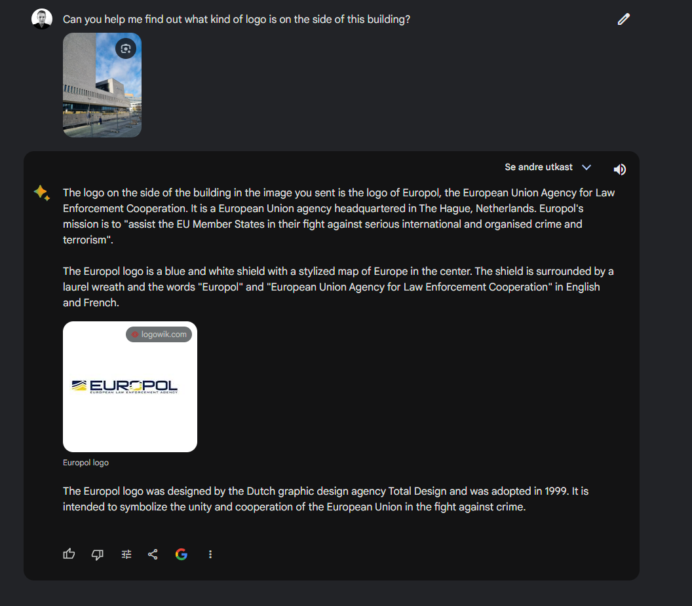
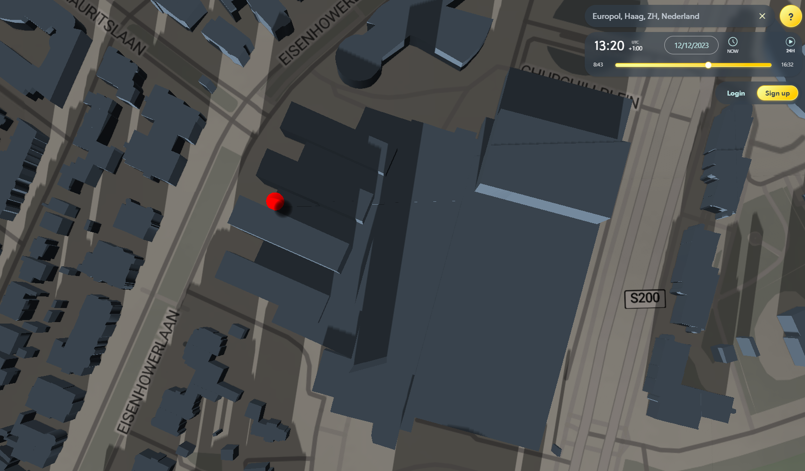

# DAY 9 - Time location

## Description
````
Gjennom et beslag har vi fått tak i et papirark. På den ene siden står det “Oppmøtested for den topphemmelige sydpolinfiltrasjonen 2023, rekognosering 23. november”. På den andre siden av arket er det et bilde. For å kunne hente inn overvåkingsbilder og identifisere hvem som har planlagt arrangementet trenger vi det nøyaktige tidspunktet bildet er tatt.

Send meg svar på denne eposten som KRIPOS{tidspunkt}, f.eks. KRIPOS{23:35}, r  undet av til nærmeste fem minutter.

- Mellomleder

📎 bilde.jpeg
````

## Solution
It can be very hard to see what the logo on the image is. So I asked bard


He identified it as a logo for Europol, Haag, ZH, Nederland. witch makes sense. All I now had to do was to go to https://app.shadowmap.org/
Find the location and date. Then drag the shadow so it fits the image. Then you get the time.




### Flag
```
KRIPOS{13:20}
```