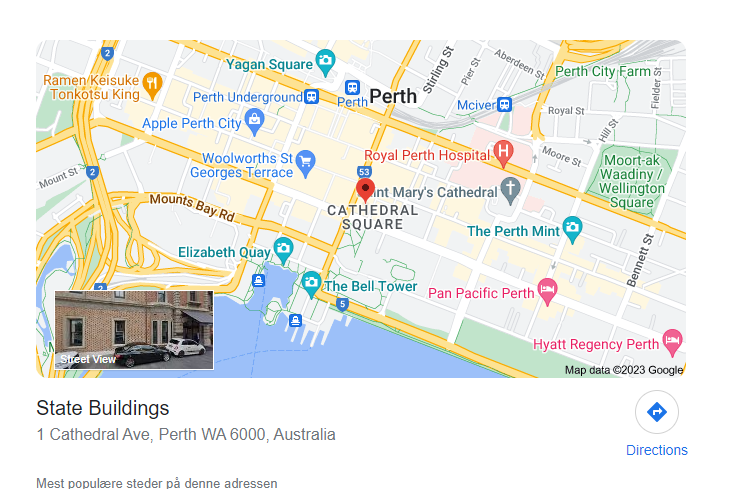
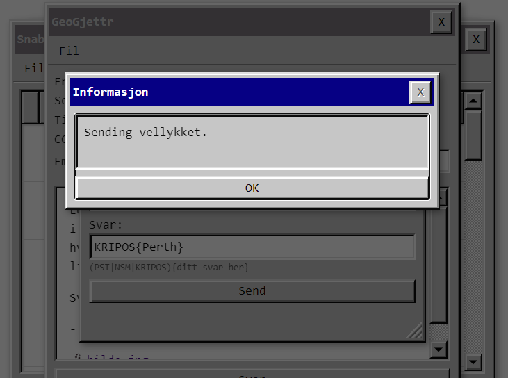

 # DAY 13 - GeoGuessr

## Description
````
Ledelsen har fått dilla på GeoGjettr og jeg er med i en konkurranse, men klarer ikke finne ut av hvilken by bildet her er fra. Kan du hjelpe meg litt fort?

Svar meg med KRIPOS{navn på by}.

- Mellomleder

📎bilde.jpg
````

## Solution
Scanning the QR code gives you the following
```
WIFI:nopass; S:The State Buildings; P:foobar; H:;;
```
A quick google search for: The State Buildings


And you can see that it is located in Perth, Australia. Send it in and you get the flag.



### Flag
```
KRIPOS{Perth}
```