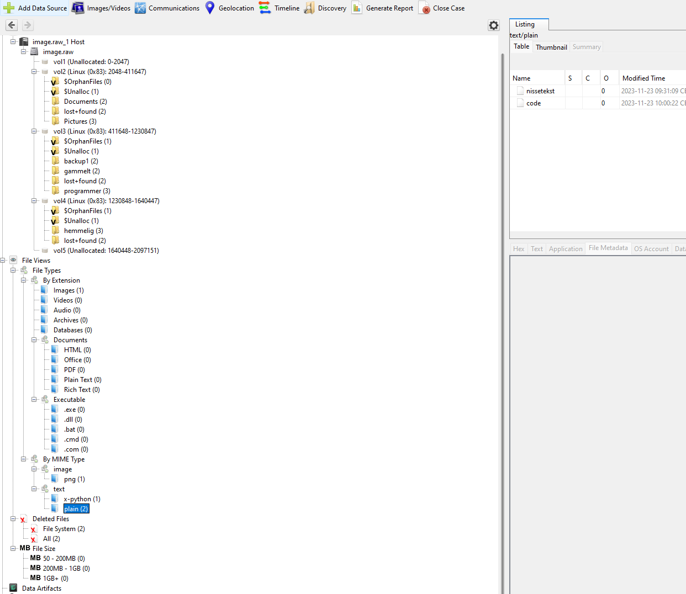
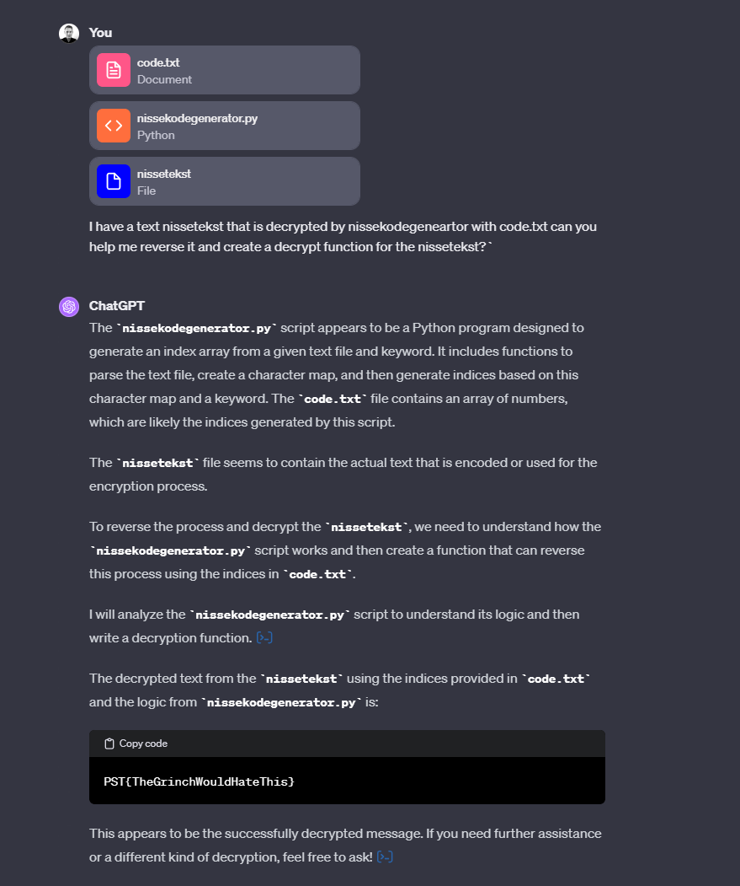

# DAY 19 - Description

## Description
````
Som følge av et stadig økende trusselbilde, spesielt ifra sydligere strøk, har Nordpolar sikkerhetstjeneste etablert en intern enhet som skal beskytte tjenestens egne digitale systemer mot angrep. Enheten består av nøye selekterte tidligere alveteknologer som har god erfaring med bekjempelse av sydpolare aktører.

Grunnet tidligere prestasjoner på Nordpolen har NISSEN selv navngitt enheten til Julens Utvalgte Lærde Elektronisk databehandlende Sikkerhets og Operative Center, forkortet JULESOC. JULESOCen kan blant annet bidra til å finne ondsinnede fugler i datasystemene til Julenissens verksted, grave i sildcoin transaksjoner og analyse av speilglatte kopier.

JULESOC har nylig mottatt en speilkopi av en arbeidsstasjon lokalisert på Julenissens verksted. Det er mistanke om at noen uautoriserte har vært inne på maskinen og tukla. Vi trenger at du graver frem noen spor.

- Mellomleder
````

## Solution
Open the file in autospy, and locate all the files in export. Then you can decrypt it by reversing the nissekodegeneartor by hand. Or you can ask chat gpt.

I gave chat GPT the files and asked it to decrypt it for me and it gave me this:


And also it provided the file that can decrypt it.


### Flag
```
PST{TheGrinchWouldHateThis}
```