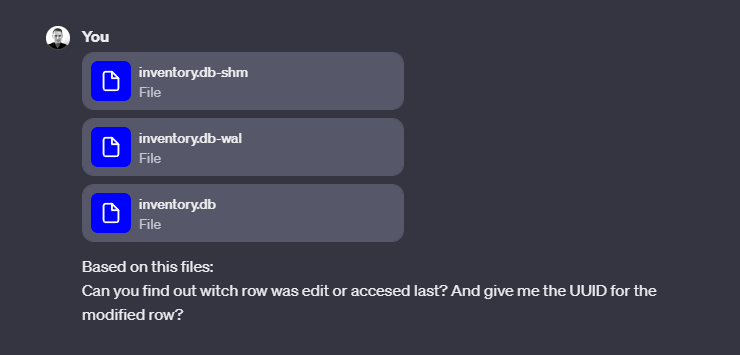

# DAY 22 - Description

## Description
````
Hei bitBug,

JULESOC har fått en alarm fra informasjonssystemet tilknyttet NISSENS gavelager på VALøya i Tromsø. Alarmen handlet om en uautorisert modifikasjon i databasen som styrer inventaret til lageret, og JULESOC har sendt oss databasefilene slik de forekom på tidspunktet alarmen gikk.

Har du mulighet til å sjekke ut filene og finne ut hvilken rad som er blitt modifisert?

📎 ALARM_JULESOC.zip

Returner UUID til den modifiserte raden, f.eks. PST{6eab374e-735f-416e-bcc6-81b4b8dfc7a9}
````

## Solution
You can use the wall and shm file to locate the last view and edit row. Since this is a sqlite database,
they are provind support when many users are accessing it at the time. This is a task that GPT can handle very well
for us. 

I provieded the file to GPT and got the following result:

```
To determine which row was edited or accessed last in your SQLite database files, I'll inspect the contents of inventory.db, inventory.db-shm, and inventory.db-wal. The inventory.db file is the main database file, while inventory.db-shm and inventory.db-wal are used for handling concurrent database access and contain information about recent changes that have not yet been fully committed to the main database file.

I'll start by examining inventory.db to identify the structure and contents of the database. Then, I'll look at inventory.db-wal to identify the most recent changes. The inventory.db-shm file is typically used as a shared memory file for coordinating access to the database and may not contain direct information about row modifications, but I will also check it to ensure no relevant information is overlooked.

Let's begin with examining inventory.db.

The inventory.db database contains a single table named gifts. To identify the most recently accessed or modified row, I will now examine the gifts table to understand its structure, specifically looking for any columns that might indicate timestamps or last modification dates.

Let's proceed to inspect the structure and content of the gifts table. ​​

The gifts table in your inventory.db database has the following structure:

uuid: Text field, likely used as a unique identifier for each row.
giftname: Text field, probably the name of the gift.
quantity: Integer field, possibly indicating the quantity of each gift.
However, this table does not contain any columns that directly indicate the timestamp or date of the last modification. To find the most recently modified row, I will next examine the inventory.db-wal file. This file contains the Write-Ahead Logging (WAL) information, which logs changes before they are committed to the main database. This should give us insights into the most recent changes, including the UUID of the modified row.

Let's proceed with examining the inventory.db-wal file. ​​

The inventory.db-wal file exists and is not empty, which suggests that there are uncommitted changes or recent modifications that have not yet been fully merged into the main inventory.db file.

I will now analyze the contents of the inventory.db-wal file to identify the most recently modified row and extract its UUID. This process involves reading the Write-Ahead Logging (WAL) data, which can be complex as it's not structured like a typical SQL table. I'll proceed with the analysis. ​​

The recent changes in the inventory.db-wal file show the last few rows of the gifts table. Here are the details of these rows, including their UUIDs:

UUID: 786cc89f-d617-4cc3-b3af-64ca35c72b29 - Giftname: "Small Spring bud Easy-Bake Oven" - Quantity: 50965
UUID: 7126309a-9ab4-4115-b437-b3a4c0683b96 - Giftname: "Small Spring bud Joy Buzzer" - Quantity: 40409
UUID: 09335112-0e7c-4be1-ac70-b2d7e888f62a - Giftname: "Small Spring bud Koosh Ball" - Quantity: 41284
UUID: fa632ded-db53-4a21-877d-d5a5813ee173 - Giftname: "Small Spring bud Red Ryder BB Gun" - Quantity: 75908
UUID: d753a091-a525-46d4-995a-20d95de1d9e0 - Giftname: "Small Spring bud Two-Handed Pogo Stick" - Quantity: 95801
These rows represent the most recent changes to the gifts table. The UUID 786cc89f-d617-4cc3-b3af-64ca35c72b29 corresponds to the most recently modified or accessed row, based on the available WAL data. If you need further details or specific modifications, please let me know! ​
```


### Flag
```
PST{786cc89f-d617-4cc3-b3af-64ca35c72b29}
```